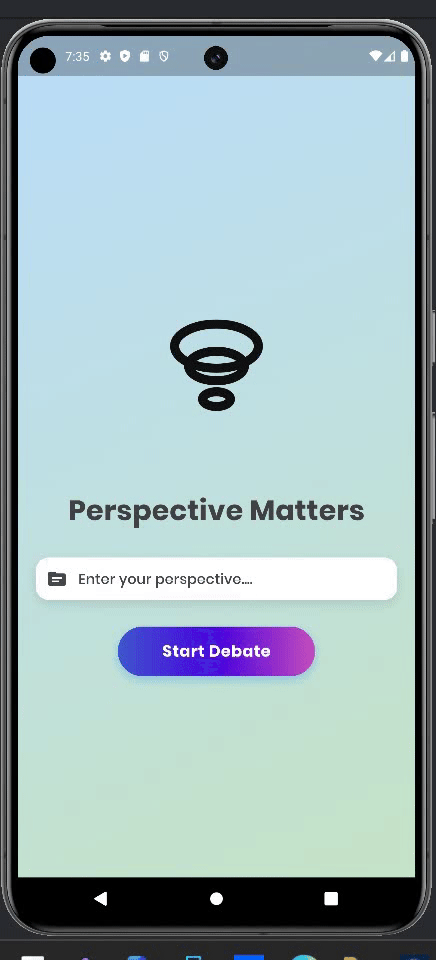
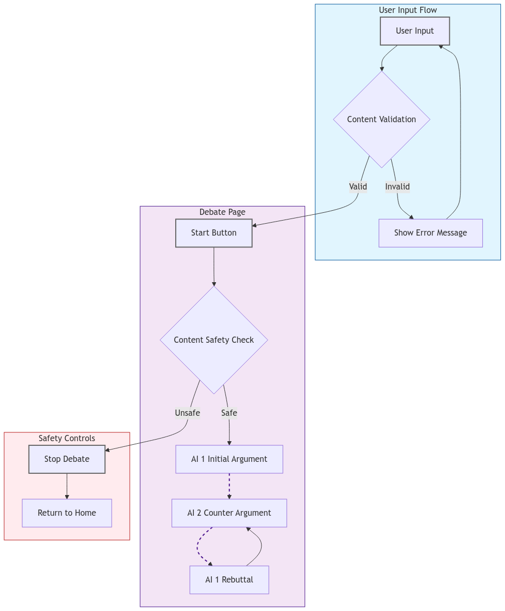

# Perspective Matters: Bridging Social Divides Through AI-Driven Debate 🌍
# Digital Jam Hackathon

## [Visit Working Prototype](https://perspectivemattersnssce.streamlit.app/)

> 

## 📌 What is Perspective Matters?
Perspective Matters is an AI-powered debate simulation app where two intelligent AI agents engage in structured debates on any topic. The app challenges biases, breaks echo chambers, and fosters critical thinking by presenting both sides of an argument in a dynamic and engaging format.

## 🚀 Key Features
- **AI vs. AI Debates** – Two AI-powered debaters take opposing sides on any given topic.
- **Structured Arguments** – AI follows strict debating principles to keep arguments logical, concise, and impactful.
- **Topic Validation** – Ensures only meaningful, debatable topics are used.
- **Real-World & Philosophical Topics** – Debates cover everything from AI ethics to free will to government policies to anything that is possible to be debated.

## ⚙️ How It Works
1. **User enters a debate topic**
2. **AI validates the topic**
3. **Character 1 (Pro) & Character 2 (Con) engage in a structured debate**
4. **Each response is logical, concise (max 8 sentences), and engaging**
5. **Debate continues until stopped**

## 🛠 Tech Stack
- **Flutter** – Frontend & UI
- **Google Gemini AI** – AI-powered debate generation
- **Flutter TTS** – AI speech synthesis for realistic debate voices
- **GetX** – State management

## WorkFlow
> 

## 📥 Installation & Setup (Only Android Device Supported For Now)
You can install the app from this site: [Install The App](https://perspectivematters.streamlit.app/).
You can visit various demo workings of the app here too: [Install The App](https://perspectivematters.streamlit.app/)

## 🎯 Why This Matters
In an era of social division and misinformation, Perspective Matters restores balanced discourse and challenges users to see beyond their biases. This app is not just a tool—it’s a step toward intellectual honesty and critical thinking.

## 🔥 Showcasing the App
### Best Debate Topics to Test
- **Is Artificial Intelligence a Threat to Humanity?**
- **Does Free Will Truly Exist, or Is It Just an Illusion?**
- **Should the Internet Be Censored to Protect Society?**

These debates highlight the AI’s reasoning ability, clarity, and depth of argumentation.

## 🤝 Contributors
- **Ashhar P.S** – Founder & Developer  

## ⚖️ License
MIT License. Feel free to use, modify, and contribute.

🚀 **Challenge Your Perspective. Debate Smarter. Improve Your Critical Thinking** 🚀
